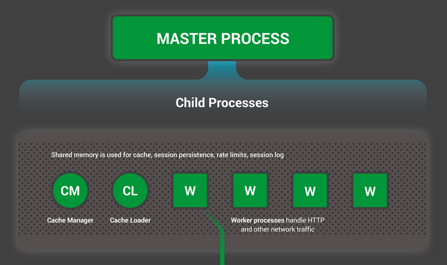
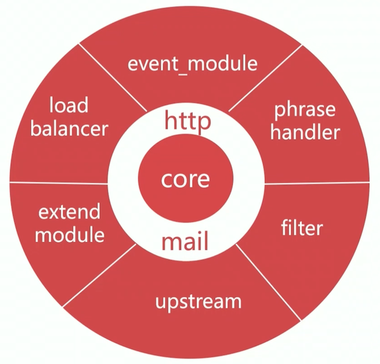
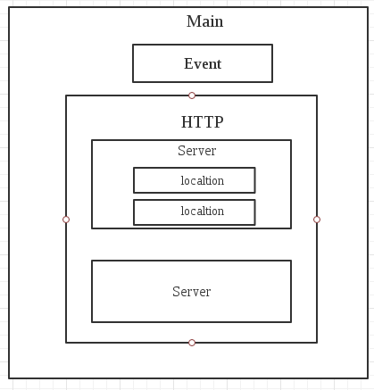

# NGINX 笔记

## 功能

1. 静态资源服务器
2. 反向代理服务器
3. API服务

## 优势

1. 高并发，高性能
2. 扩展性好
3. 异步非阻塞的事件驱动模型 
4. 可靠性高，开销小
5. 热部署 
6. 平滑升级
7. BSD开源协议

## 基础

### 安装

```bash
 yum install nginx -y
 apt install nginx
 pacman -S nginx 
```


### 启动

```bash
nginx #直接启动
nginx -c configfile #指定配置文件
```


### 进程结构



参考链接：
[Inside NGINX: Designed for Performance & Scalability](https://www.nginx.com/blog/inside-nginx-how-we-designed-for-performance-scale/)

### 命令行管理nginx

```
reload : HUP

reopen : USR1

stop : TERM

quit : QUIT
```


### Nginx  reload配置文件的流程

1. 向Nginx发送reload命令
2. master进程检查配置文件是否正确
3. master进程打开监听端口
4. master进程使用心得配置文件打开新的worker子进程
5. master进程向老的worker子进程发送QUIT信号
6. 旧的worker进程关闭监听句柄，处理完后关闭。

### 热部署

1. 将旧的nginx二进制文件替换成新的nginx二进制文件
2. 向master进程发送USR2信号
3. master进程修改pid文件，加后缀.oldbin
4. master进程用新的nginx文件启动新的master进程
5. 向久的master进程发送WINCH信号，旧的worker子进程退出
6. 回滚：向旧master发送HUP，向新的master发送QUIT

### Nginx模块化管理机制

#### 核心模块

* ngx_core
* ngx_errlog
* ngx_conf
* ngx_events
* ngx_epoll
* ngx_regex
* ngx_event
 
#### 标准http模块

* ngx_http_core
* ngx_http_charset
* others

#### 可选http模块

* ngx_http_gzip
* ngx_http_ssl
* others

#### mail服务模块

* ngx_mail_core
* ngx_mail_pop3
* others

#### 第三方模块

* rds_json_ngxin
* lua_nginx
* others

#### 模块体系结构



Nginx 的内部结构是由核心部分和一系列的功能模块所组成。这样划分是为了使得每个模块的功能相对简单，便于开发，同时也便于对系统进行功能扩展。为了便于描述，下文中我们将使用 Nginx core 来称呼 Nginx 的核心功能部分。
Nginx 提供了 Web 服务器的基础功能，同时提供了 Web 服务反向代理，Email 服务反向代理功能。Nginx core实现了底层的通讯协议，为其他模块和 Nginx 进程构建了基本的运行时环境，并且构建了其他各模块的协作基础。除此之外，或者说大部分与协议相关的，或者应用相关的功能都是在这些模块中所实现的。

##### 模块概述

Nginx 将各功能模块组织成一条链，当有请求到达的时候，请求依次经过这条链上的部分或者全部模块，进行处理。每个模块实现特定的功能。例如，实现对请求解压缩的模块，实现 SSI 的模块，实现与上游服务器进行通讯的模块，实现与 FastCGI 服务进行通讯的模块。
有两个模块比较特殊，他们居于 Nginx core 和各功能模块的中间。这两个模块就是 http 模块和 mail 模块。这 2 个模块在 Nginx core 之上实现了另外一层抽象，处理与 HTTP 协议和 Email 相关协议（SMTP_POP3_IMAP）有关的事件，并且确保这些事件能被以正确的顺序调用其他的一些功能模块。
目前 HTTP 协议是被实现在 http 模块中的，但是有可能将来被剥离到一个单独的模块中，以扩展 Nginx 支持 SPDY 协议。

##### 模块的分类

Nginx 的模块根据其功能基本上可以分为以下几种类型：
* event module: 搭建了独立于操作系统的事件处理机制的框架，及提供了各具体事件的处理。包括 ngx_events_module， ngx_event_core_module和ngx_epoll_module 等。Nginx 具体使用何种事件处理模块，这依赖于具体的操作系统和编译选项。

* phase handler: 此类型的模块也被直接称为 handler 模块。主要负责处理客户端请求并产生待响应内容，比如 ngx_http_static_module 模块，负责客户端的静态页面请求处理并将对应的磁盘文件准备为响应内容输出。

* output filter: 也称为 filter 模块，主要是负责对输出的内容进行处理，可以对输出进行修改。例如，可以实现对输出的所有 html 页面增加预定义的 footbar 一类的工作，或者对输出的图片的 URL 进行替换之类的工作。

* upstream: upstream 模块实现反向代理的功能，将真正的请求转发到后端服务器上，并从后端服务器上读取响应，发回客户端。upstream 模块是一种特殊的 handler，只不过响应内容不是真正由自己产生的，而是从后端服务器上读取的。

* load-balancer: 负载均衡模块，实现特定的算法，在众多的后端服务器中，选择一个服务器出来作为某个请求的转发服务器。

参考链接：
[Nginx 的模块化体系结构](https://www.w3cschool.cn/nginx/yg731pe9.html)

### 常用编译参数

**—prefix**

指定安装的目录

**—user**

运行 ngInX的 worker子进程的属主

**—group**

运行 nginx的 worker子进程的属组

**—pid-path**

存放进程运行pid文件的路径

**—conf-path**

配置文件 nginx. conf的存放路径

**—error-log-path**

错误日志 errorlog的存放路径

**—http-log-path**

访问日志accesslog的存放路径

**—with- pcre**

pcre库的存放路径,正则表达式会用到

**—with-zlib**

zib库的存放路径,gzi模块会用到

参考链接：

[Installation and Compile-Time Options | NGINX](https://www.nginx.com/resources/wiki/start/topics/tutorials/installoptions/)


### Nginx配置文件结构




