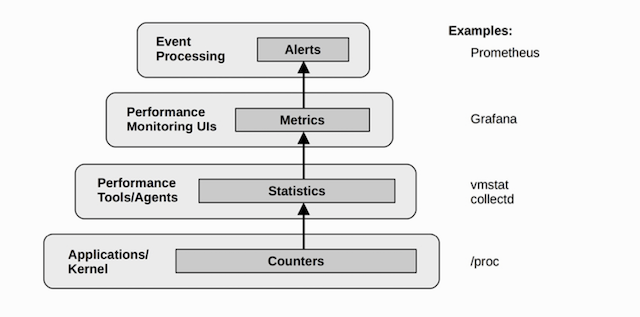

# System Performance: Enterprise and Cloud

## 序言

本章学习目标：

- 理解系统性能，角色，活动和挑战。

- 理解观测工具和实验工具的区别。

- 对性能观测量有基本理解：数据，采样分析，火焰图，跟踪，静态指令和动态指令。

- 学习任务方法论和 Linux60 秒排查。

### 性能

系统性能研究包含软硬件部分，它们都对性能有影响，目标是提升终端用户体验和减少计算消耗。

一个通用的系统软件栈：

### 角色

系统性能由不同的任务角色所决定。每个角色只关注自己的领域。但是在某些系统问题上需要不同角色之间的协作。

某些公司会雇佣专门的性能分析团队与不同角色合作解决性能问题，并且开发相关的工具。

### 活动

系统性能与很多活动有关。

以下的步骤帮助在软件从开发到部署中提高性能发挥作用：

- 制定性能目标和性能模型

- 了解软件原型和硬件的性能特征

- 在测试环境对开发中的软件进行性能分析

- 对新版本软件进行非回归测试

- 压测生产版本

- 在生产环境验证测试

- 对生产进行调整

- 在调整中监控软件变化

- 对生产问题进行性能分析

- 回顾生产问题

- 开发软件去增强系统性能

开发团队在开发初期往往不重视生产性能，往往导致后期出现生产性能问题后更加难以修复。

金丝雀测试和蓝绿测试在允许失败的情况下发布让产品在生产发布，以达到性能分析的目的。

不同的公司可以在以上步骤中按照需求选择。

### 不同视角

负载分析和资源分析是系统分析的两个不同视角。

系统管理员对系统资源负责，开发者则主要关注负载。性能分析需要两方面一起配合。

### 挑战

#### 主观

生产问题是客观的，可以判断是否存在，而性能问题是客观的，对于不同的人会有不同的结论。客观的性能问题可以通过确定一个清晰的目标变得主管，比如明确响应延迟时间范围。

#### 复杂度

我们往往不知道从哪个环节开始分析问题，有时候我们会预设问题所在，从那里开始入手，分析人员必须明确那里是不是问题所在。

性能问题也来源于复杂的交互活动，一个系统可能在单独分析时表现很好，与其他组件交互时出现问题，我们必须知道它们之间怎么互相影响的。

性能瓶颈也是复杂和难以预料的，修复了一处往往会出现另一处，系统性能整体上没有提升。

性能也受复杂的生产负载影响，在实验环境难以复现并且偶发。

性能问题需要对系统从内而外整体分析，因此要求性能工程师需要有广泛的技能，是一项很有挑战的工作。

#### 多因素影响

一个性能问题可能没有一个明确的原因，而是多个不同的原因同时发生导致的，同时也可能导致多个性能问题。

#### 多个性能问题

当线上出现多个性能问题是，我们需要优先明确对提升负载最有效的，优先修复。

### 延迟

延迟是系统的性能的重要指标。消除延迟可以最大程度上提升性能。

延迟在不同领域有所区别，在网络，它指建立建立连接所需的时间也可以指包括数据传输在内的整个过程耗时，因此，需要区分为连接延迟和传输延迟。

### 可观测性

可观测性指我们可以通过工具来观察和理解系统。包括计数器，采样分析工具，追踪工具。

在生产环境需要先运行观测工具，因为压测工具会占用资源影响性能。

#### 计数器

应用和系统在它们内部存储了有关它们自身状态和活动的数据：运行次数，字节数，延迟，资源利用率和错误率。这些数据由性能工具定时读取并计算出平均值，百分比等。

#### 指标

指标是被挑选出来作为目标监控和评估的。大多数公司会持续监控指标并可视化数据来做监控和告警。

一个典型的告警系统。

#### 采样分析

采样分析指对系统的一部分测量量进行采样。常常被用在 CPU 上。

一个有效的 CPU 采样可视化是火焰图。通过观察不同的 cpu 消耗，可以判断出不同的问题。

#### 跟踪

跟踪会记录基于事件的数据并存下来供后续分析使用。

有一些专门目的的跟踪工具比如 strace 和 tcpdump，也有通用的程序分析工具比如 Linux Ftrace，BCC，bpftrace。

##### 静态测量

硬编码在程序中的测量点，在 Linux 中叫做 tracepoints，在用户空间的类似工具叫做 USDT，被一些库所使用。

execsnoop 会打印被 execve 所创建的进程，当创建过程执行到 tracepoint 时。

##### 动态测量

动态测量在程序启动后创建测量点，通过修改内存中的指令，在中间插入指令动作。类似于 debug 在运行中的软件插入断点。

##### BPF

BPF 是动态追踪增强工具，早期是作为小型内核虚拟机用来加速 tcpdump 表达式，后来得到了扩展成了 eBPF，成为了通用的运行环境，用来提供快速安全的资源。

### 实验性工具

大多数是压测工具，通过构造请求来压测系统性能。宏工具用来模拟正式请求，微工具用来测试某一组件。

### 云计算

云计算，一种按需部署资源的方式。

更高的单机性能带来更少的示例部署，就会有更少的费用。

单机示例会收到同母机上的其他隔离实例的影响，使得观测更加困难。

### 方法论

一些推荐的排查步骤，避免手足无措。

#### 60 秒分析 Linux 性能

| 工具               | 检测内容                                           |
| ------------------ | -------------------------------------------------- |
| uptime             | 系统在 1，5，15 分钟的负载升降                     |
| dmesg -T \| tail   | 包括 OOM 在内的内核错误                            |
| vmstat -SM 1       | 系统范围的数据，执行队列长度，交换空间，CPU 总负载 |
| mpstat -P ALL 1    | 显示单个 CPU 的负载                                |
| pidstat 1          | 进程级别的 CPU 消耗和内核态用户态时间              |
| iostat -sxz 1      | 磁盘 IO 数据，IOPS，吞吐率，平均等待时间，繁忙程度 |
| free -m            | 文件系统缓存在内的内存使用率                       |
| sar -n DEV 1       | 检测网络 IO 设备的包和吞吐量                       |
| sar -n TCP ,ETCP 1 | TCP 连接重传率                                     |
| top                | 系统总览                                           |

### 例子

#### 磁盘慢IO

数据库查询慢，后来发现被另一个程序影响了。

#### 软件变更

软件性能上不去，查了半天发现是单线程在运行。

## 方法论