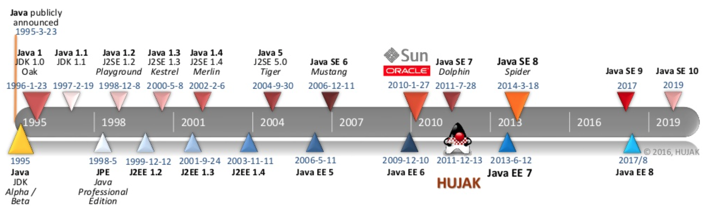

## 走进 Java

### Java 技术体系

- Java 程序语言

- 各种硬件平台上的 JVM 实现

- Class 文件格式

- Java 类库 API

- 来自商业机构和开源社区的第三方 Java 类库

### Java 产品线

- Java Card

- Java ME

- Java SE

- Java EE

### 发展史

### JVM 家族

- Sun Classis/Exact VM

- HotSpot VM

- Mobile/Embedded VM

- EBA JRockit/IBM J9 VM

- BEA Liquid VM/Azul VM

- Apache Harmony/Google Android Dalvik VM

- Microsoft JVM 及其他

## 自动内存管理

### Java内存区域与内存溢出异常

#### 概述 

