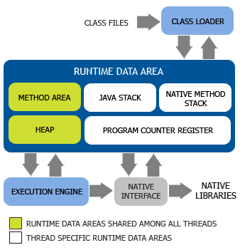

## 走进 Java

### Java 技术体系

- Java 程序语言

- 各种硬件平台上的 JVM 实现

- Class 文件格式

- Java 类库 API

- 来自商业机构和开源社区的第三方 Java 类库

### Java 产品线

- Java Card

- Java ME

- Java SE

- Java EE

### 发展史

### JVM 家族

- Sun Classis/Exact VM

- HotSpot VM

- Mobile/Embedded VM

- EBA JRockit/IBM J9 VM

- BEA Liquid VM/Azul VM

- Apache Harmony/Google Android Dalvik VM

- Microsoft JVM 及其他

## 自动内存管理

### Java内存区域与内存溢出异常

#### 运行时数据区域

##### 程序计数器

线程私有 

如果是Java方法，存有当前字节码指令的地址

如果是本地方法，值为Undefined

##### Java虚拟机栈

线程私有

虚拟机栈描述了Java方法执行的线程内存模型：每个方法被执行的时候，Java虚拟机都会同步创建一个栈帧用于存储局部变量表，
操作数栈，动态链接，方法出口等信息。每一个方法被调用到执行完毕的过程，对应着一个栈帧从入栈到出栈的过程。

局部变量表存储了编译期可知的各种Java虚拟机基本数据类型，引用对象，和returnAddress类型。

局部变量表的内存分配在编译期完成，64位的long和double占两个变量槽，其余占一个，槽的大小由具体的实现决定。

##### 本地方法栈

和虚拟机栈相似，主要为了本地方法调用服务，由各家虚拟机决定实现方式。

##### 堆

